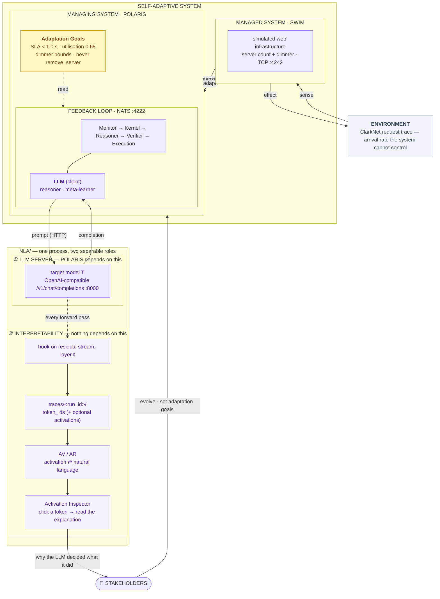

# SummerWork

Research setup for studying **LLM-based self-adaptation and interpretability**:
an LLM decides how a running system should adapt, and we read its activations to
explain *why*.

Three pieces, each independently runnable:

| Directory | Role | What it is |
|---|---|---|
| [SWIM/](SWIM/) | **managed system** | Simulated web infrastructure with two knobs — server count and a "dimmer" trading response fidelity for latency. Runs in Docker, controlled over TCP on port 4242. |
| [POLARIS/](POLARIS/) | **managing system** | LLM-based self-adaptation framework (Pandey et al., 2025). Reads SWIM telemetry, reasons about it, and enacts adaptation actions. |
| [NLA/](NLA/) | **LLM server + interpretability** | Natural Language Autoencoder (Anthropic, 2026). Two roles in one process: it *serves* the model POLARIS reasons with, and it *reads* that model's activations and turns them into natural-language explanations. See [the split](#the-interpretability--llm-server-split). |

`BSN/` and `TAS/` are other SEAMS exemplars, parked for now — nothing below
involves them. Project background and the longer plan are in
[PROJECT_PLAN.md](PROJECT_PLAN.md).

## How they fit together

The layering follows the standard conceptual model of a self-adaptive system
(Weyns, Fig. 1.2): an **environment** at the bottom, a **managed system** acting
on it, a **managing system** above that closing a feedback loop against explicit
**adaptation goals**, and **stakeholders** outside the system boundary.

This project adds one element that model does not have. POLARIS's feedback loop
reasons with an **LLM**, so the decisive step is no longer a rule or a
controller you can read — it is a forward pass. The **interpretability** block
attaches to that LLM and gives stakeholders a way to ask *why*.



The same thing in plain text, if mermaid will not render where you are reading.
First the self-adaptive system, read bottom-up as in the conceptual model:

```
                     ┌──────────────────────────────┐
                     │         STAKEHOLDERS         │
                     └───┬──────────────────────▲───┘
        evolve · set     │                      │
        adaptation goals │                      └───── explanations, from ② below
  ╔══════════════════════▼══════════════════════════════════════╗
  ║ SELF-ADAPTIVE SYSTEM                                         ║
  ║  ┌────────────────────────────────────────────────────────┐  ║
  ║  │ MANAGING SYSTEM · POLARIS                              │  ║
  ║  │  ┌────────────────────┐                                │  ║
  ║  │  │ Adaptation Goals   │┄┄┄ read ┄┄┄┐                   │  ║
  ║  │  │ SLA < 1.0 s        │            │                   │  ║
  ║  │  │ utilisation 0.65   │            ▼                   │  ║
  ║  │  └────────────────────┘  ┌──────────────────────────┐  │  ║
  ║  │                          │ FEEDBACK LOOP · NATS     │  │  ║
  ║  │                          │ Monitor → Kernel →       │  │  ║
  ║  │                          │ Reasoner → Verifier →    │  │  ║
  ║  │                          │ Execution                │  │  ║
  ║  │                          │ ┌──────────────────────┐ │  │  ║
  ║  │                          │ │ LLM (client)         │ │  │  ║
  ║  │                          │ │ reasoner · meta-l.   │ │  │  ║
  ║  │                          │ │ ─────────────▶ ①     │ │  │  ║
  ║  │                          │ └──────────────────────┘ │  │  ║
  ║  │                          └──────────────────────────┘  │  ║
  ║  └──────────┬──────────────────────────────▲──────────────┘  ║
  ║       sense │                              │ adapt           ║
  ║  ┌──────────▼──────────────────────────────┴──────────────┐  ║
  ║  │ MANAGED SYSTEM · SWIM                                  │  ║
  ║  │ server count + dimmer · TCP :4242                      │  ║
  ║  └──────────┬──────────────────────────────▲──────────────┘  ║
  ╚═════════════┼══════════════════════════════┼═════════════════╝
          sense │                              │ effect
  ┌─────────────▼──────────────────────────────┴────────────────┐
  │ ENVIRONMENT                                                 │
  │ ClarkNet request trace — arrival rate the system            │
  │ cannot control, only respond to                             │
  └─────────────────────────────────────────────────────────────┘
```

And the block the LLM attaches to — the part this project adds:

```
       from POLARIS's LLM client
                  │  prompt (HTTP)
                  ▼
  ┌────────────────────────────────────────────────────────────┐
  │ ① LLM SERVER · NLA/ :8000                                  │
  │    target model T · /v1/chat/completions                   │
  │    POLARIS depends on this; any OpenAI-compatible          │
  │    endpoint would do                                       │
  └───────┬────────────────────────────────────────┬───────────┘
          │ completion (HTTP)                      │ every forward pass
          ▼                                        ▼
   back to POLARIS            ┌─────────────────────────────────┐
                              │ ② INTERPRETABILITY · NLA/       │
                              │    hook on residual stream, ℓ   │
                              │            │                    │
                              │            ▼                    │
                              │    traces/<run_id>/             │
                              │    token_ids (+ activations)    │
                              │            │                    │
                              │            ▼                    │
                              │    AV / AR                      │
                              │    activation ⇄ text            │
                              │            │                    │
                              │            ▼                    │
                              │    Activation Inspector         │
                              │    click a token → read why     │
                              └────────────────┬────────────────┘
                                               │ explanations
                                               ▼
                                        to STAKEHOLDERS
```

### The interpretability / LLM-server split

`NLA/` looks like one component but plays two roles, and keeping them distinct is
what makes the setup tractable:

| | ① LLM server | ② Interpretability |
|---|---|---|
| Serves | the target model `T` over `/v1/chat/completions` | explanations of `T`'s activations |
| POLARIS depends on it | **yes** — it is the reasoner's LLM backend | **no** — POLARIS has no idea it exists |
| Replaceable by | vLLM, OpenRouter, any OpenAI-compatible endpoint | nothing; this is the research contribution |
| Fails ⇒ | the SAS stops adapting | you lose explanations, the SAS runs on |

Three consequences worth stating plainly:

- **The interpretability block is an observer, not a participant.** It sits
  outside the control loop. Removing it changes nothing about how the system
  adapts — which is exactly what makes any explanation it produces trustworthy
  evidence about the loop rather than an influence on it.
- **POLARIS ↔ NLA is plain HTTP.** POLARIS calls the server as an ordinary
  OpenAI-compatible endpoint and needs no NLA-specific code. This also keeps the
  dependency sets apart: POLARIS's venv has `nats`/`grpc` and no `torch`; NLA's
  has `torch`/`transformers` and no `nats`.
- **Capture and explanation are separate passes.** The server records each call
  to `traces/`; turning activations into text happens later, possibly on another
  machine. That is not tidiness — at 7B the target (15.2 GB) and the AV/AR pair
  (26.1 GB) are 41.3 GB together, so collection and explanation *have* to be
  separable. Because a trace stores `token_ids`, activations are exactly
  reproducible by re-running the forward pass, so `NLA_CAPTURE=text` records the
  cheap half and rebuilds the rest on demand.

## Getting started

### Prerequisites

- **Docker** (SWIM and NATS run as containers)
- **tmux** (POLARIS runs its 9 components in a tmux session)
- **Python 3.12+**, and a GPU if you want reasonable speed
- The trained AV/AR checkpoint pair — see [NLA/models/README.md](NLA/models/README.md)

### One-time setup

Two virtualenvs, deliberately separate (their dependencies conflict in spirit if
not in fact, and each subproject must stay runnable alone):

```bash
# POLARIS
python3 -m venv POLARIS/.venv
POLARIS/.venv/bin/pip install -r POLARIS/polaris_poc/requirements.txt

# NLA  (torch build is host-specific; never copy this venv between machines)
python3 -m venv NLA/.venv
NLA/.venv/bin/pip install -r NLA/requirements.txt
```

Put the trained checkpoints in `NLA/models/<backbone>/{av,ar}.pt`. For the
0.5B reproduction:

```bash
mkdir -p NLA/models/Qwen2.5-0.5B
rsync -avP <user>@<workstation>:'~/NLA/NLA_reproduce/models/*.pt' NLA/models/Qwen2.5-0.5B/
```

### Run it

The system comes up as two halves, each its own script, because they usually run
on two different machines:

| Half | Script | Needs | Provides |
|---|---|---|---|
| **NLA** | `./start_nla.sh` | GPU, torch | target model, activation capture, UI |
| **POLARIS + SWIM** | `./start_polaris.sh` | Docker, tmux | the adaptation loop and the managed system |

Neither needs what the other needs — the GPU box need not have Docker, and the
Docker box need not have a GPU — because the only link between them is HTTP.

**On one machine** (needs both sets of prerequisites):

```bash
./start.sh          # NLA, then SWIM + POLARIS + bridge
./stop.sh           # stop all of it
```

**On two machines.** Start NLA first; it is much the slowest to load. Then, from
the POLARIS box, one SSH command wires both directions:

```bash
# on the GPU box
./start_nla.sh

# on the POLARIS box
ssh -L 8000:127.0.0.1:8000 -R 8090:127.0.0.1:8090 user@gpu-box   # leave open
./start_polaris.sh
```

`-L 8000` lets POLARIS's reasoner reach the NLA server; `-R 8090` lets the NLA
server reach POLARIS's dashboard bridge. Both match the defaults, so the tunnel
needs no extra configuration, and the UI stays single-origin (no CORS).

Stop each half with `./stop_nla.sh` and `./stop_polaris.sh`.

### Configuration

Per-machine settings live in `.env` at the repo root — gitignored, with every
key documented in the committed [.env.example](.env.example):

```bash
cp .env.example .env
```

These are plain environment variables: `NLA/src/config.py` is already fully
env-overridable and POLARIS already reads `polaris_poc/.env`, so this is one
more place to put values, not a new mechanism. Anything exported in your shell
still wins over the file.

One deliberate exception: `NLA_PROBE_LAYER` is *not* configured here. The probe
layer is a property of the released AV/AR checkpoint pair, not of the machine,
so it lives in `PROBE_LAYERS` in `NLA/src/config.py` where a wrong value gets
reviewed rather than drifting silently per host.

Then open:

| | |
|---|---|
| http://localhost:8000/ | **Activation Inspector** — chat with the target model, click any token, read the AV's explanation of its activation |
| http://localhost:8000/architecture.html | **Architecture view** — the POLARIS/SWIM control loop with live component activity, SWIM telemetry, and routing |
| http://localhost:8000/docs | API docs |
| http://localhost:6901/ | SWIM's own noVNC display |
| `tmux attach-session -t polaris-swim` | POLARIS's 9 components, one per window |

Useful flags:

```bash
./start_nla.sh --device cpu                        # force CPU (GPU busy)
./start_nla.sh --model Qwen/Qwen2.5-7B-Instruct    # different backbone (needs its own checkpoints)
./start_nla.sh --foreground                        # run in this terminal, no pidfile
./start_polaris.sh --no-nla                        # leave the reasoner on Gemini/OpenRouter
./start_polaris.sh --nla-url http://host:8000/v1   # NLA somewhere other than the tunnel
./stop_polaris.sh --rm                             # also delete the SWIM/NATS containers
```

Service logs and pidfiles go to `run/` (gitignored). POLARIS's own component
logs stay in `POLARIS/polaris_poc/logs/`.

### First run notes

- The NLA server downloads model weights on first start (~1 GB for
  Qwen2.5-0.5B) into `NLA/models/hf/`, and takes 30–60 s to load `T`, `AV` and
  `AR` before it answers. `start.sh` waits for it.
- **The 0.5B model cannot actually drive POLARIS.** It is a base model, not
  instruction-tuned, and POLARIS's reasoner expects `TOOL_CALL:` lines and JSON
  actions. Expect no valid tool calls and no parseable decision. That is fine —
  locally this setup verifies *plumbing*: that POLARIS reaches the model, that
  activations are captured, that traces land on disk and can be explained. A
  larger backbone on better hardware is what produces meaningful decisions.
- Nothing in either UI is mocked. If a service is down, the page says so rather
  than showing stale or invented numbers.
- **On a small GPU, watch VRAM.** POLARIS's prompts run to a couple of thousand
  tokens, far longer than anything the UI sends. `T`+`AV`+`AR` are ~2.8 GB
  resident at 0.5B, and a 1400-token call peaks around 3.1 GB — which fits a
  4 GB card, but not with much to spare. If you hit `CUDA out of memory`, run
  the server on CPU (`./start.sh --device cpu`); it is slower but unconstrained.

## Verifying the pieces

```bash
# NLA end to end: hook → AV → AR, with a shuffled-explanation control
NLA/.venv/bin/python NLA/scripts/check_roundtrip.py

# POLARIS ↔ NLA: drives the server with POLARIS's own LLM client, checks traces
NLA/.venv/bin/python NLA/scripts/check_polaris_interface.py --url http://localhost:8000/v1
```

## Running each piece alone

Each subdirectory stands on its own, which is what makes them debuggable:

```bash
SWIM/start_swim.sh                                     # managed system only
POLARIS/polaris_poc/start_polaris_swim_system.sh       # SWIM + POLARIS, no NLA
cd NLA && ./.venv/bin/uvicorn server.main:app --port 8000   # NLA only
cd POLARIS/polaris_poc && ../.venv/bin/python src/scripts/dashboard_bridge.py
```

## Where to read next

- [NLA/README.md](NLA/README.md) — the interpretability method, configuration,
  and moving between machines
- [NLA/server/README.md](NLA/server/README.md) — the HTTP API, traces, and how
  POLARIS attaches
- [POLARIS/README.md](POLARIS/README.md) — the adaptation framework
- [PROJECT_PLAN.md](PROJECT_PLAN.md) — research question, phases, open risks

## References

- Pandey, D. et al. *POLARIS: Is Multi-Agentic Reasoning the Next Wave in
  Engineering Self-Adaptive Systems?* 2025. arXiv:2512.04702
- Anthropic. *Natural Language Autoencoders.* 2026.
- Moreno, G. et al. *SWIM: An Exemplar for Evaluation and Comparison of
  Self-Adaptation Approaches for Web Applications.* SEAMS 2018.
